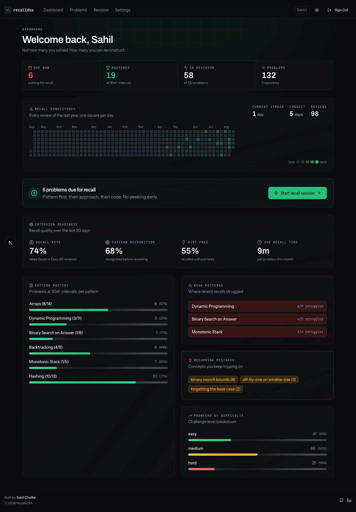
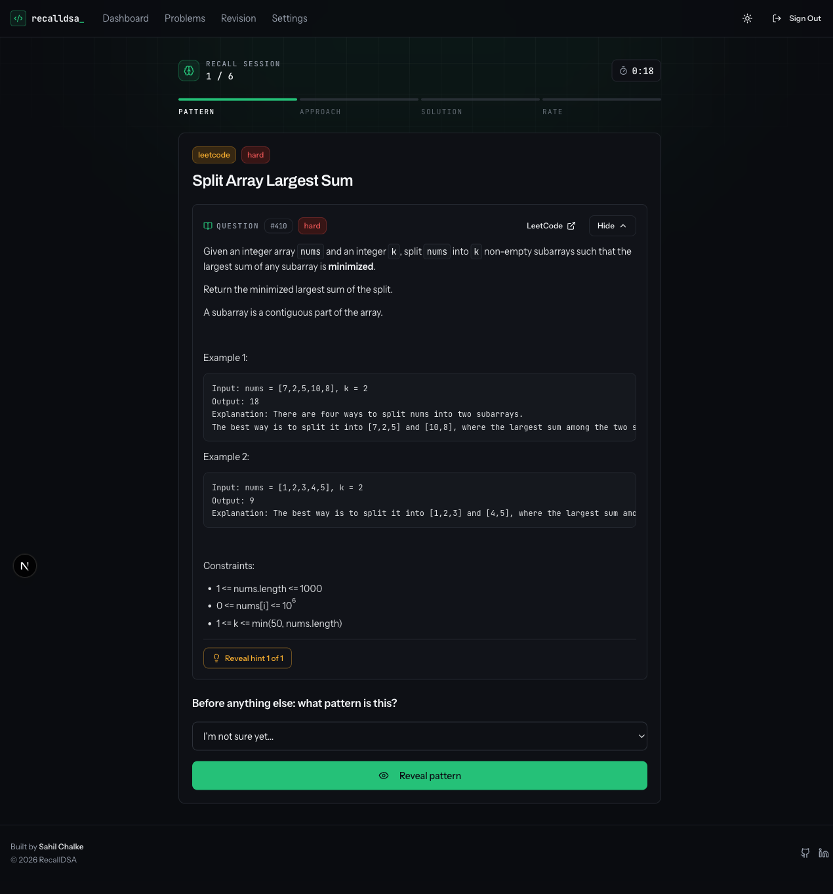
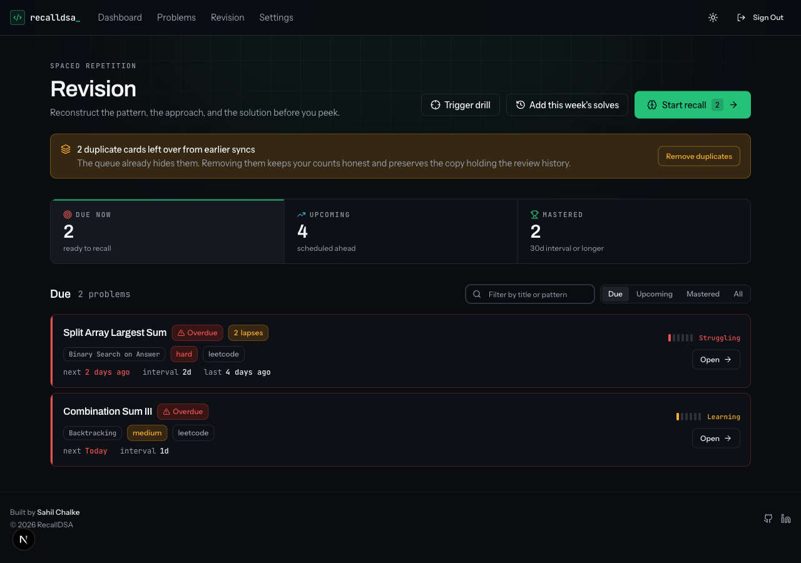
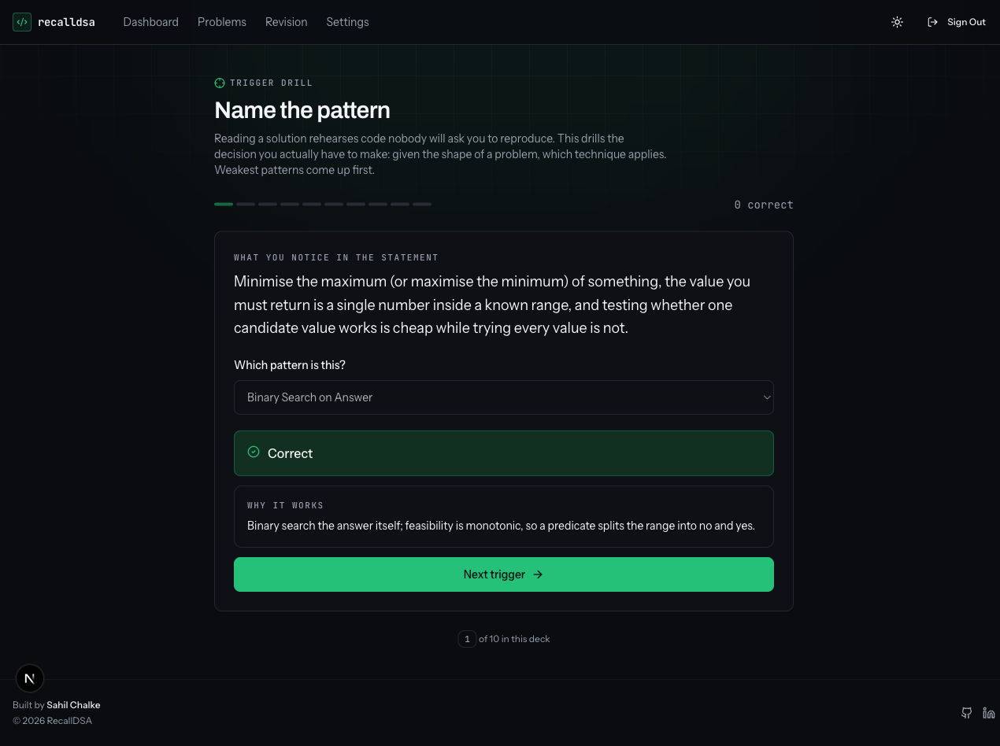
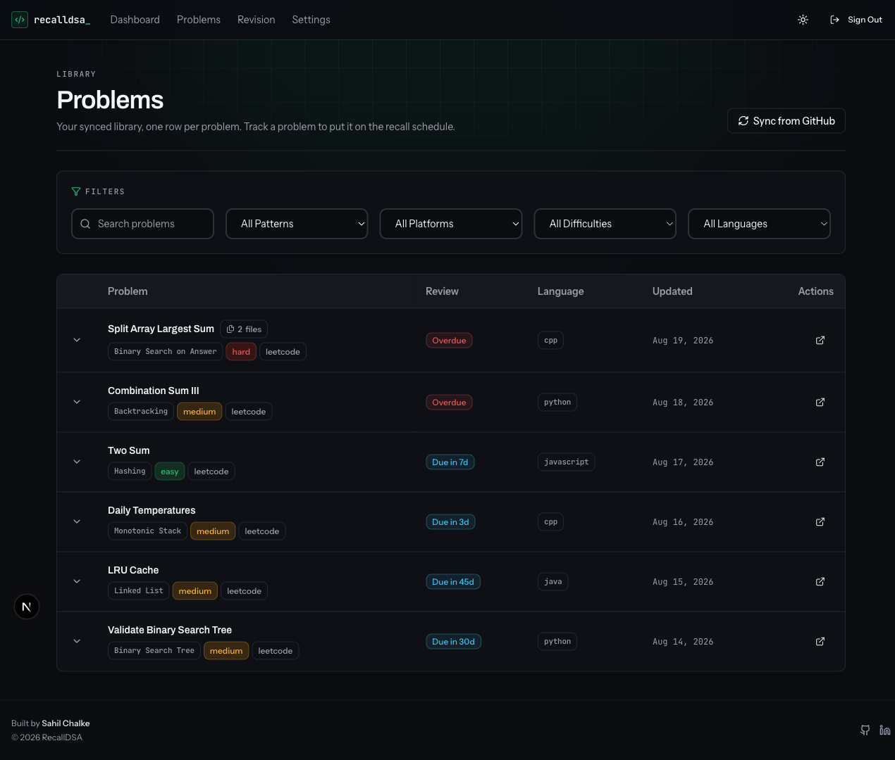
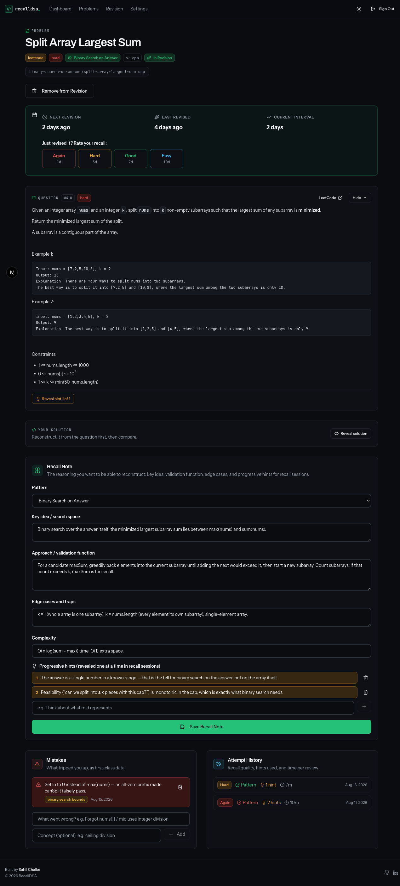
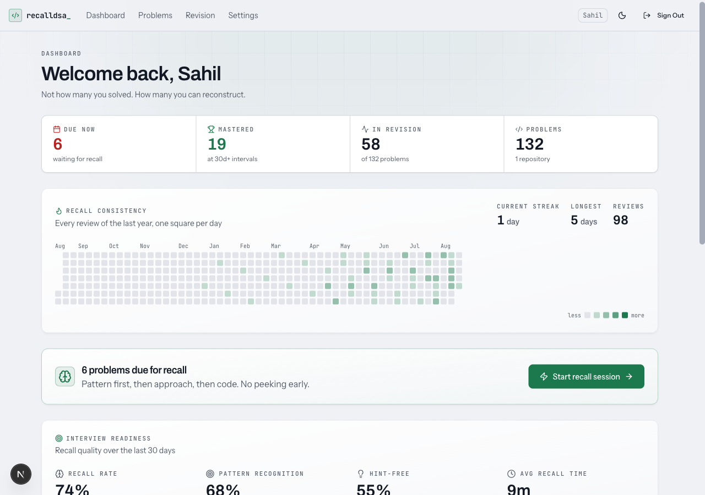
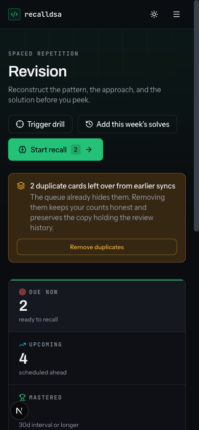

<div align="center">

# RecallDSA

**You don't forget that binary search exists. You forget how to *see* it in a new problem.**

RecallDSA syncs the DSA problems you've already solved from GitHub and trains you to **reconstruct** them: name the pattern, rebuild the approach, then check your own solution. Spaced repetition decides when each problem comes back.

[](https://recall-dsa.vercel.app)
&nbsp;
[](./LICENSE)



</div>

---

## Why this exists

Most trackers answer *"how many problems have I solved?"* That number stops being useful about a week before an interview, because solving a problem once and being able to rebuild it cold are different skills.

Two skills, actually, and RecallDSA measures them separately:

| Skill | The question it answers | Where it shows up |
|---|---|---|
| **Recognition** | "I'm minimizing a maximum and feasibility is monotonic. That's binary search on answer." | Pattern recognition rate |
| **Reconstruction** | "Given the pattern, can I derive the feasibility check myself?" | Recall rate, hints used, time to solve |

You can pass the first and fail the second. The dashboard tells you which one is actually weak.

---

## Recall sessions

The core loop. Four stages per problem, and **nothing is revealed until you've committed to an answer.**

### 0. Read the actual question

Before any of it, the real problem statement — fetched live from the judge, not a title you half-remember. You can't reconstruct a problem you don't recognize.



### 1. Name the pattern first

What kind of problem is this? Your guess is recorded and compared to the stored pattern, so recognition gets measured, not assumed.

### 2. Reconstruct the approach

Rebuild the key idea, the search space, and the validation function in your head. Stuck? Reveal **your own hints**, one at a time, and the app counts how many you needed. Then compare against the reasoning you wrote down last time.

### 3. Check the solution

Your actual code, pulled live from GitHub, gated behind a **Reveal solution** button so the reconstruction happens before the peek.

### 4. Rate honestly

Each button shows exactly when the problem comes back. Rate it **Again** and it resets to tomorrow, no matter how many times you've seen it. `Space`/`Enter` advances each stage and `1`–`4` rate without touching the mouse, since this is a drilling tool.

---

## The scheduling

SM-2, adapted for day-granularity practice ([`lib/spaced-repetition.ts`](./lib/spaced-repetition.ts), covered by unit tests):

| Rating | What happens |
|---|---|
| **Again** | Back to 1 day, records a lapse, ease factor drops 0.2 |
| **Hard** | Grows slowly (~1.2x), ease drops 0.15 |
| **Good** | Follows the 1 → 3 → 7 day ladder, then multiplies by the ease factor |
| **Easy** | 1.4x the Good interval, ease rises 0.15 |

Ease is clamped to a 1.3 floor so a problem you keep failing can't spiral, and intervals cap at 180 days. A problem sitting at a 30-day interval or longer counts as **mastered**.

---

## Your review queue

Due, upcoming, and mastered, split so the counts don't overlap and double-count. Overdue problems are marked, lapses stay visible so a problem you keep failing can't hide behind a green streak, and a retention gauge on every row shows how well it's actually holding — not just when it's next due.



The queue refreshes itself when you return to the tab, and a commit backfill runs quietly in the background every 30 minutes, so newly solved problems show up without you asking.

### Catching up on what you already solved

**Add this week's solves** reads your repo's commit history and schedules everything you solved recently, anchored to *when you actually solved it* rather than when you clicked the button.

That matters because a solve date is not a sync date. A problem you finished five days ago and never revisited is genuinely overdue; one you solved this morning shouldn't be in today's queue at all. The first review lands a day after the solve, so the queue naturally orders itself oldest-first, and today's work waits until tomorrow.

It also collapses duplicates, everywhere, not just on import. LeetHub and LeetSync both commit the same solution under different folder namings (`0875-koko-eating-bananas/0875-koko-eating-bananas.cpp` and `875-koko-eating-bananas/koko-eating-bananas.cpp`, sometimes under different problem numbers), which would otherwise queue the same problem two or three times. A directory naming a topic (`backtracking/`) is told apart from one naming a problem (`0046-permutations/`), a pattern comes from the judge's own topic tags rather than guessed from the path, and a banner surfaces any duplicate cards still left over from before this existed, with a one-click cleanup that keeps whichever copy holds the review history.

---

## Trigger drill

Reading your own solution rehearses code nobody will ask you to reproduce. The actual transferable skill is narrower: given the shape of a problem, which technique applies. The trigger drill isolates exactly that, no code, no problem context, just the structural features of a statement and a guess at the pattern they imply.



The deck orders itself by where you actually struggle, pulled from 90 days of real recall attempts, so the pattern you keep missing comes up first instead of last.

---

## Your library

Everything synced from your repo, filterable by pattern, platform, difficulty, and language, with a live review state per problem. A problem committed under two paths — a rewrite in a second language, a folder rename — shows once, with a badge noting how many files back it. Expand any row to preview the code without leaving the page.



---

## Per-problem memory

This is what makes recall sessions worth anything. For each problem you keep:

- **The reasoning** you want to reconstruct: key idea, search space, validation function, edge cases, complexity
- **A hint ladder** you wrote yourself, revealed one nudge at a time
- **Mistakes as first-class data**, tagged with the underlying concept
- **Attempt history**: rating, whether you recognized the pattern, hints used, time taken



Log the same concept a few times and it surfaces on the dashboard as a **recurring mistake**. "You keep getting binary-search bounds wrong" is a far more useful signal than a solved count.

---

## Both themes, and it works on a phone

<div align="center">

&nbsp;

</div>

---

## GitHub sync

Connect a repo once and RecallDSA reads its tree. Pattern and difficulty come from the judge's own topic tags first (LeetCode's public GraphQL API), falling back to the path only for problems the judge doesn't recognize — a path names the problem, not the technique it uses.

After that a webhook keeps it current: new solutions you push enter the review queue automatically, edits refresh the metadata, and files you delete are removed — unless that file's problem already carries review history, in which case it's kept, because a rename is a new path, not evidence the problem is gone. There's a manual **Sync from GitHub** button too.

The first import is deliberately *not* auto-scheduled. Importing 675 problems and having 675 reviews land due on day one is how a review queue gets abandoned; you pick what to track.

### Streak reminders

A daily cron checks whether a live streak is about to lapse — streak alive, nothing reviewed today, and something genuinely due, all three, or it stays quiet. The email mirrors the app's own dark theme and links straight to the due problems, both in the app and on the judge.

---

## Tech

**Next.js 15 (App Router) · TypeScript · Prisma · PostgreSQL · NextAuth v5 (GitHub OAuth) · Octokit · Nodemailer · Tailwind CSS · Framer Motion · Vitest**

```
app/
  api/                REST routes: problems, revisions, repos, mistakes, cron, webhook
  revision/recall/    the staged recall session
  revision/triggers/  the pattern-trigger drill
  dashboard/          readiness metrics, computed server-side
lib/
  spaced-repetition.ts    the SM-2-derived scheduler (pure, unit tested)
  problem-identity.ts     canonical problem identity — the one dedup source of truth
  revision-queue.ts       collapses duplicate revisions, keeping the one with history
  pattern-detection.ts    topic-tag classification, path heuristics as fallback
  pattern-triggers.ts     the 28-card trigger deck and weakness-based drill order
  leetcode.ts             LeetCode GraphQL client, cached
  activity.ts             streak and consistency-calendar math
  streak-reminder.ts      streak-risk assessment and the reminder email template
  sanitize-html.ts        allowlist sanitizer for judge-supplied statement HTML
  solve-history.ts        solve-date scheduling and duplicate collapsing (unit tested)
  github.ts               tree walking, path parsing, commit dates
  app-url.ts              resolves the app's real origin for outbound email links
  auth.ts                 NextAuth config
prisma/schema.prisma      User, Repo, Problem, Revision, RecallNote, Attempt, Mistake
```

---

## Running it locally

**Prerequisites:** Node.js 18+, a PostgreSQL database, and a GitHub OAuth app.

```bash
git clone https://github.com/Sahilll15/RecallDSA.git
cd RecallDSA
npm install

cp .env.example .env
# fill in DATABASE_URL, GITHUB_CLIENT_ID, GITHUB_CLIENT_SECRET, AUTH_SECRET

npm run prisma:generate
npx prisma migrate dev

npm run dev     # http://localhost:3000
npm test        # scheduler unit tests
```

Your GitHub OAuth app's callback URL must be `http://localhost:3000/api/auth/callback/github` (and the deployed equivalent in production).

### Deploying

The build runs `prisma generate` only, so apply schema changes yourself before or during a deploy:

```bash
npx prisma migrate deploy
```

Daily reminder emails run off the Vercel cron in [`vercel.json`](./vercel.json), authenticated with `CRON_SECRET`.

---

## Contributing

Contributions welcome, see [CONTRIBUTING.md](./CONTRIBUTING.md).

## License

[MIT](./LICENSE)

<div align="center"><sub>Built by <a href="https://sahilchalke.com">Sahil Chalke</a></sub></div>
