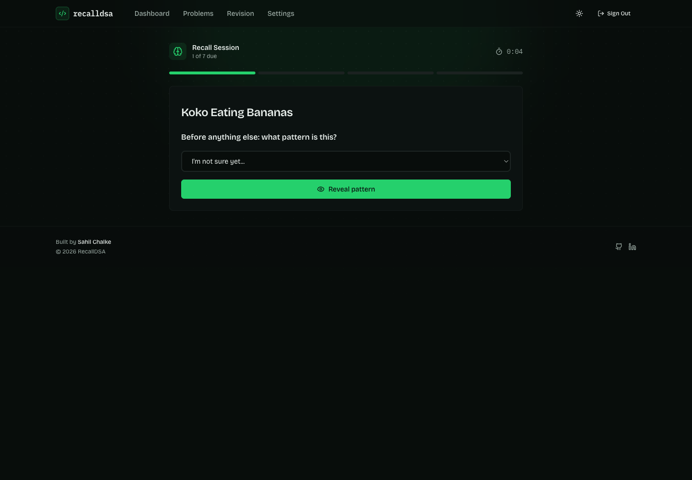
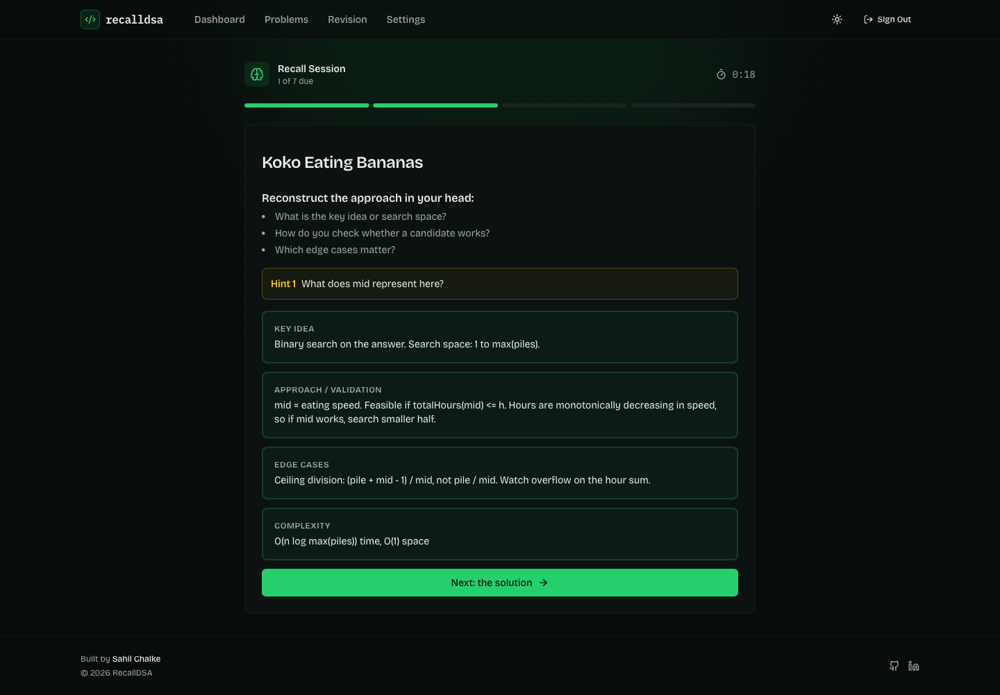
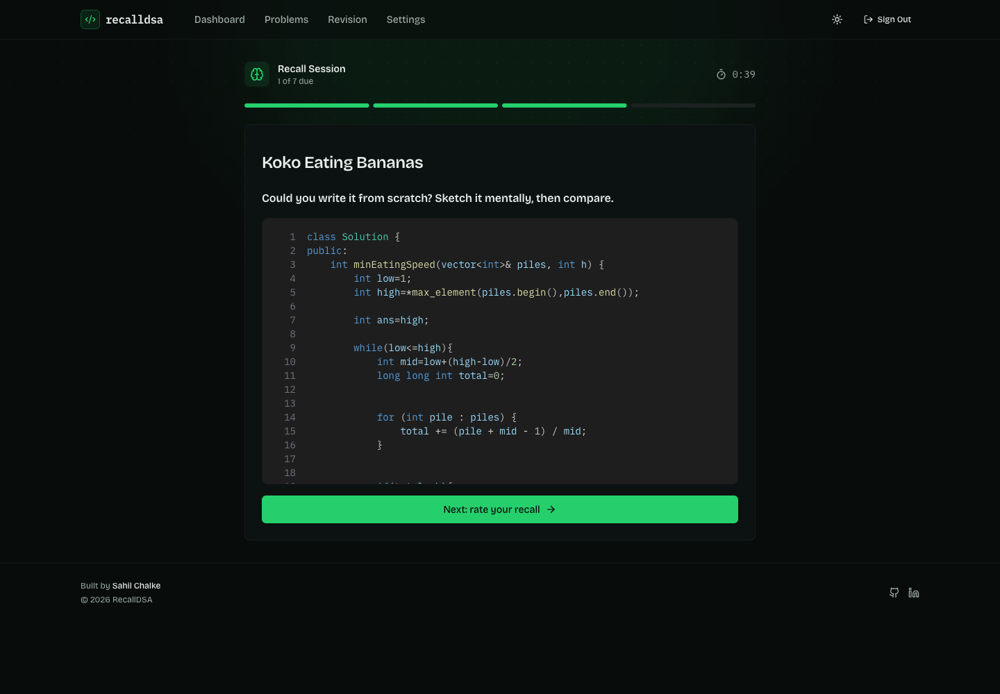
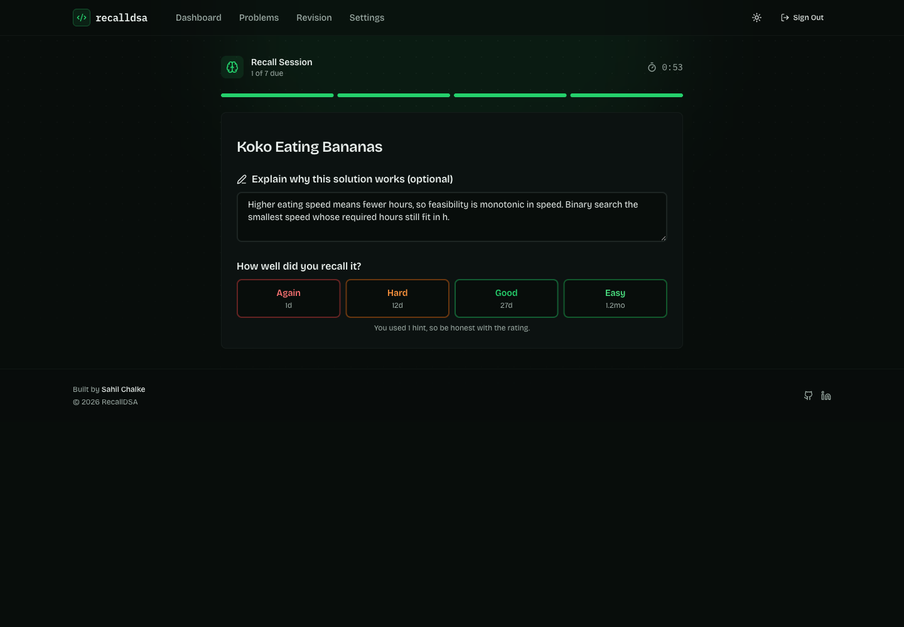

<div align="center">

# RecallDSA

**You don't forget that binary search exists. You forget how to *see* it in a new problem.**

RecallDSA syncs the DSA problems you've already solved from GitHub and trains you to **reconstruct** them: name the pattern, rebuild the approach, then check your own solution. Spaced repetition decides when each problem comes back.

[](https://recall-dsa.vercel.app)
&nbsp;
[](./LICENSE)


</div>

---

## Why this exists

Most trackers answer *"how many problems have I solved?"* That number stops being useful about a week before an interview, because solving a problem once and being able to rebuild it cold are different skills.

Two skills, actually, and RecallDSA measures them separately:

| Skill | The question it answers | Where it shows up |
|---|---|---|
| **Recognition** | "I'm minimizing a maximum and feasibility is monotonic. That's binary search on answer." | Pattern recognition rate |
| **Reconstruction** | "Given the pattern, can I derive the feasibility check myself?" | Recall rate, hints used, time to solve |

You can pass the first and fail the second. The dashboard tells you which one is actually weak.

---

## Recall sessions

The core loop. Four stages per problem, and **nothing is revealed until you've committed to an answer.**

### 1. Name the pattern first

Before the code, before the notes, before anything: what kind of problem is this? Your guess is recorded and compared to the stored pattern, so recognition gets measured, not assumed.



### 2. Reconstruct the approach

Rebuild the key idea, the search space, and the validation function in your head. Stuck? Reveal **your own hints**, one at a time, and the app counts how many you needed. Then compare against the reasoning you wrote down last time.



### 3. Check the solution

Your actual code, pulled live from GitHub. No copy in a database that drifts out of date.



### 4. Rate honestly

Each button shows exactly when the problem comes back. Rate it **Again** and it resets to tomorrow, no matter how many times you've seen it.



---

## The scheduling

SM-2, adapted for day-granularity practice ([`lib/spaced-repetition.ts`](./lib/spaced-repetition.ts), covered by unit tests):

| Rating | What happens |
|---|---|
| **Again** | Back to 1 day, records a lapse, ease factor drops 0.2 |
| **Hard** | Grows slowly (~1.2x), ease drops 0.15 |
| **Good** | Follows the 1 → 3 → 7 day ladder, then multiplies by the ease factor |
| **Easy** | 1.4x the Good interval, ease rises 0.15 |

Ease is clamped to a 1.3 floor so a problem you keep failing can't spiral, and intervals cap at 180 days. A problem sitting at a 30-day interval or longer counts as **mastered**.

---

## Your review queue

Due, upcoming, and mastered, split so the counts don't overlap and double-count. Overdue problems are marked, and lapses stay visible so a problem you keep failing can't hide behind a green streak.


---

## Your library

Everything synced from your repo, filterable by pattern, platform, difficulty, and language, with a live review state per problem. Expand any row to preview the code without leaving the page.


---

## Per-problem memory

This is what makes recall sessions worth anything. For each problem you keep:

- **The reasoning** you want to reconstruct: key idea, search space, validation function, edge cases, complexity
- **A hint ladder** you wrote yourself, revealed one nudge at a time
- **Mistakes as first-class data**, tagged with the underlying concept
- **Attempt history**: rating, whether you recognized the pattern, hints used, time taken


Log the same concept a few times and it surfaces on the dashboard as a **recurring mistake**. "You keep getting binary-search bounds wrong" is a far more useful signal than a solved count.

---

## Both themes, and it works on a phone

<div align="center">

&nbsp;

</div>

---

## GitHub sync

Connect a repo once and RecallDSA reads its tree, parsing each solution file for pattern, platform, difficulty, and language from the path (LeetHub-style `0875-koko-eating-bananas/` layouts and folder-per-pattern layouts both work).

After that a webhook keeps it current: new solutions you push enter the review queue automatically, edits refresh the metadata, and files you delete are removed. There's a manual **Sync from GitHub** button too.

The first import is deliberately *not* auto-scheduled. Importing 675 problems and having 675 reviews land due on day one is how a review queue gets abandoned; you pick what to track.

---

## Tech

**Next.js 15 (App Router) · TypeScript · Prisma · PostgreSQL · NextAuth v5 (GitHub OAuth) · Octokit · Nodemailer · Tailwind CSS · Framer Motion · Vitest**

```
app/
  api/            REST routes: problems, revisions, repos, mistakes, cron, webhook
  revision/recall/ the staged recall session
  dashboard/      readiness metrics, computed server-side
lib/
  spaced-repetition.ts   the SM-2 scheduler (pure, unit tested)
  github.ts              tree walking, path parsing, pattern detection
  auth.ts                NextAuth config
prisma/schema.prisma     User, Repo, Problem, Revision, RecallNote, Attempt, Mistake
```

---

## Running it locally

**Prerequisites:** Node.js 18+, a PostgreSQL database, and a GitHub OAuth app.

```bash
git clone https://github.com/Sahilll15/RecallDSA.git
cd RecallDSA
npm install

cp .env.example .env
# fill in DATABASE_URL, GITHUB_CLIENT_ID, GITHUB_CLIENT_SECRET, AUTH_SECRET

npm run prisma:generate
npx prisma migrate dev

npm run dev     # http://localhost:3000
npm test        # scheduler unit tests
```

Your GitHub OAuth app's callback URL must be `http://localhost:3000/api/auth/callback/github` (and the deployed equivalent in production).

### Deploying

The build runs `prisma generate` only, so apply schema changes yourself before or during a deploy:

```bash
npx prisma migrate deploy
```

Daily reminder emails run off the Vercel cron in [`vercel.json`](./vercel.json), authenticated with `CRON_SECRET`.

---

## Contributing

Contributions welcome, see [CONTRIBUTING.md](./CONTRIBUTING.md).

## License

[MIT](./LICENSE)

<div align="center"><sub>Built by <a href="https://sahilchalke.com">Sahil Chalke</a></sub></div>
